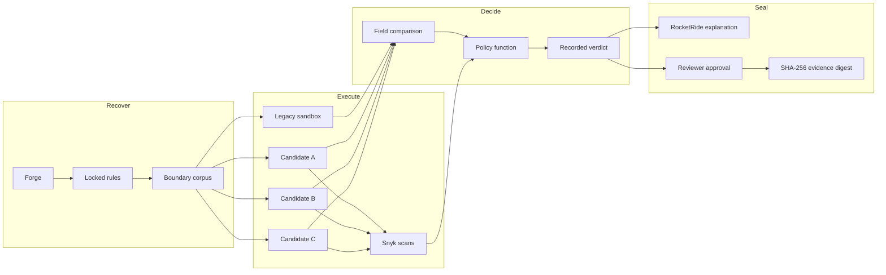
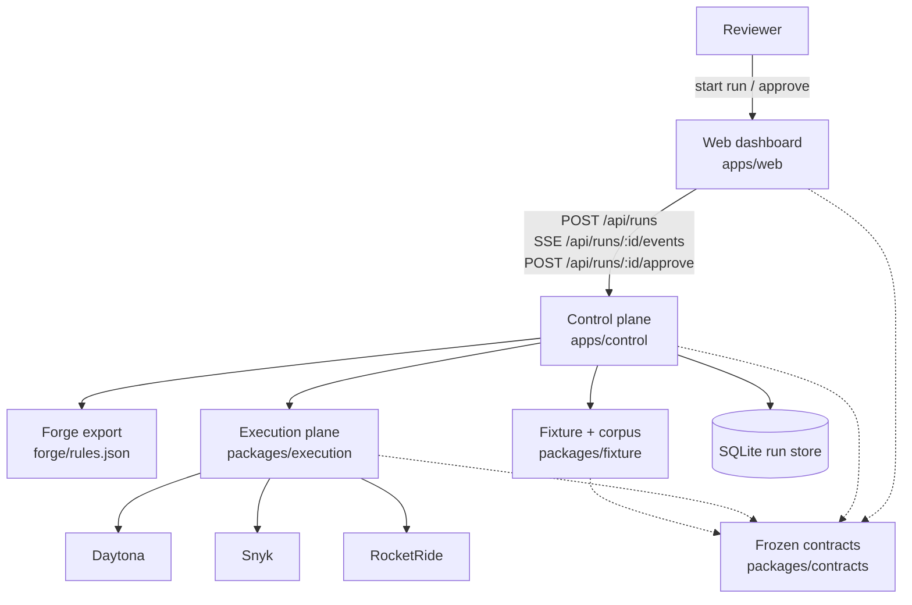
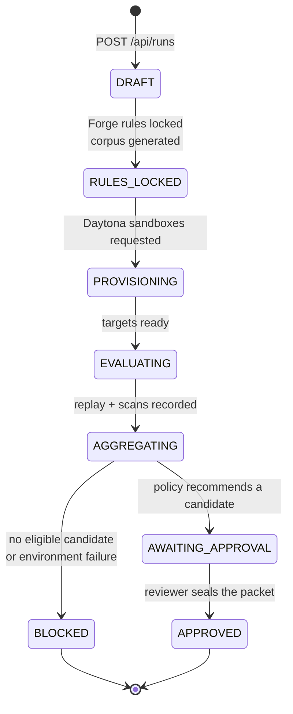
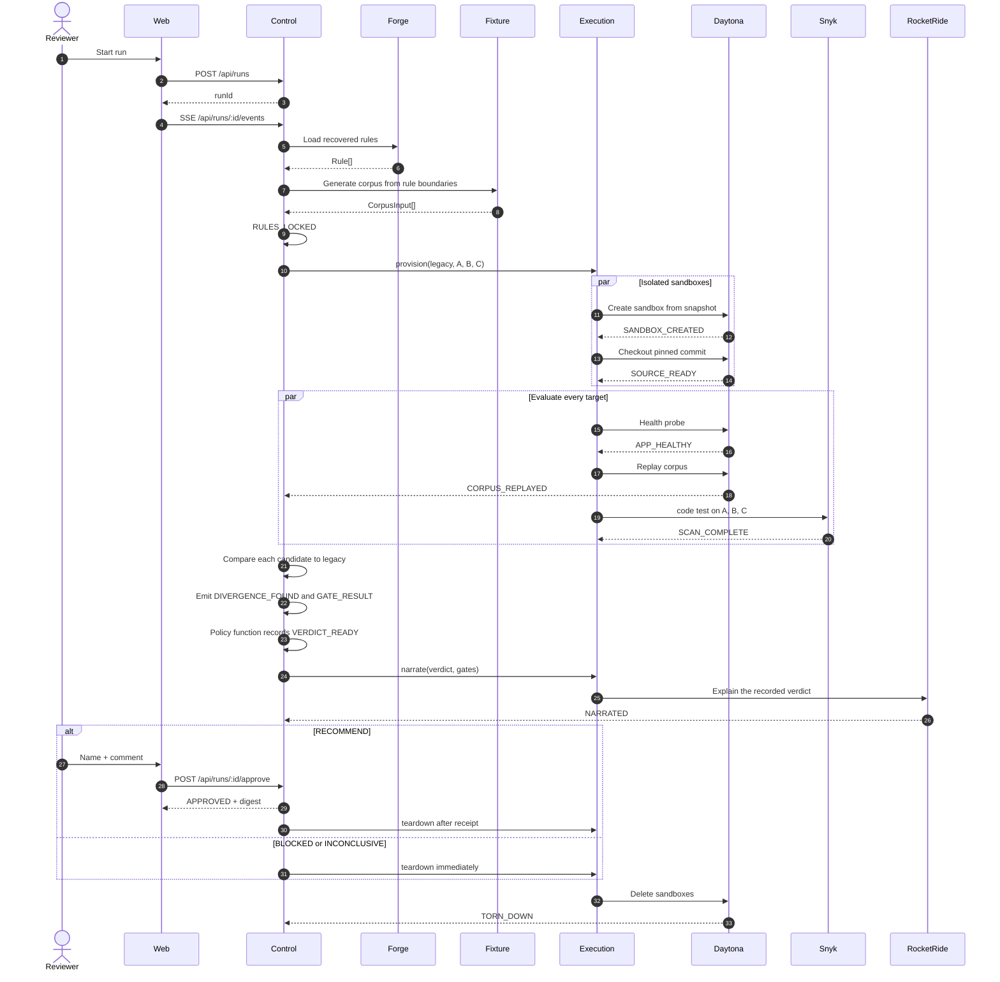
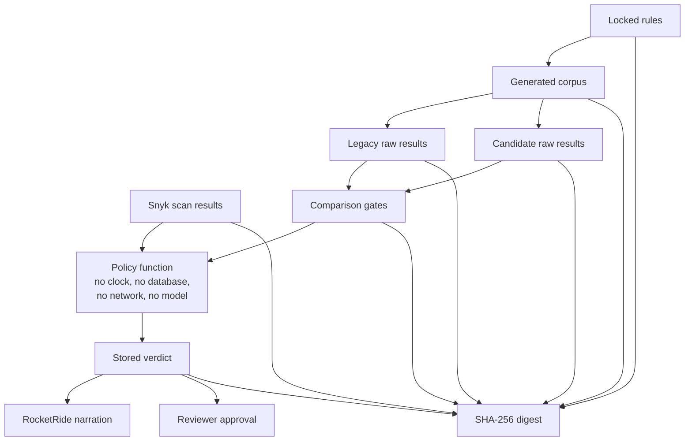
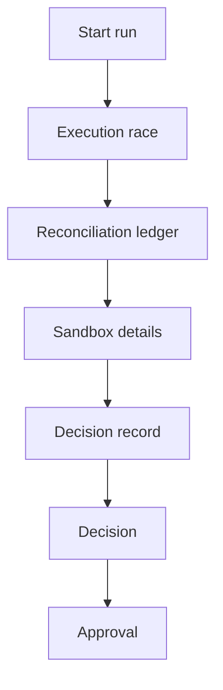
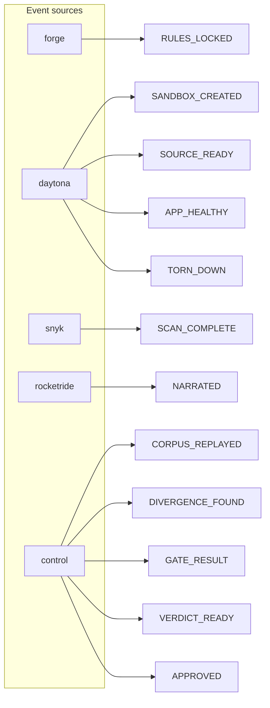

# IntentGuard

IntentGuard decides whether an AI rewrite of a legacy service is safe to ship.

It recovers the business rules the old system already follows, generates a
corpus of boundary inputs from those rules, executes the legacy service and
every rewrite candidate in isolated sandboxes, compares the live outputs, scans
the rewrites for security findings, and records a verdict a human can seal.

The expected values come from what the legacy system actually does, not from
anyone's opinion about what it should do. A model may recover intent and
explain the result. It never votes on pass or fail. Execution decides.

## Table of contents

- [What the product is](#what-the-product-is)
- [Problem](#problem)
- [Solution](#solution)
- [System architecture](#system-architecture)
- [Run lifecycle](#run-lifecycle)
- [What happens after a run starts](#what-happens-after-a-run-starts)
- [Evidence and decision](#evidence-and-decision)
- [Dashboard](#dashboard)
- [Events](#events)
- [Repository layout](#repository-layout)
- [Module ownership](#module-ownership)
- [Where fallbacks are and are not allowed](#where-fallbacks-are-and-are-not-allowed)
- [Prerequisites](#prerequisites)
- [Quick start](#quick-start)
- [Control API](#control-api)
- [Verification commands](#verification-commands)
- [Non-negotiables](#non-negotiables)

## What the product is

An agent can rewrite a legacy service in minutes. IntentGuard is the
verification record that follows that rewrite.

A reviewer starts a run. IntentGuard then:

1. Locks the business rules Forge recovered from the legacy source.
2. Builds a corpus of inputs that probe those rules at their edges.
3. Stands up the legacy service and candidates A, B, and C in matching
   Daytona sandboxes from one snapshot.
4. Replays the same corpus against every target.
5. Scans each rewrite with Snyk before its comparison result is trusted.
6. Compares candidate responses to the legacy responses.
7. Applies a deterministic policy function and records a verdict.
8. Asks RocketRide to explain the already-final result.
9. Lets a reviewer approve a recommended packet and bind it with a SHA-256
   digest.

The living baseline is the legacy service. Candidates A, B, and C are the
rewrites under test. Candidate B matches legacy behavior and carries a
command-injection fixture so the security gate has a real finding to catch.

## Problem

Nobody can tell, from a diff or from an agent's own explanation, whether a
rewrite still behaves like the old system. Legacy business rules are often
undocumented. The code itself is the only real record, including edge cases
nobody wrote down: rounding, threshold boundaries, negative amounts, role
checks.

A rewrite can look correct, pass a hand-written test suite, and still change
what happens at those edges. The first place that shows up is production.

Trusting the agent's explanation of its rewrite, or a model's opinion on
whether the diff "looks right," brings back the exact risk the rewrite was
supposed to fix.

## Solution

IntentGuard tests for correctness instead of guessing at it:

1. **Recover the rules.** Forge reads the legacy source and writes the
   business rules the legacy system actually follows (`forge/rules.json`),
   including the ones nobody wrote down.
2. **Build a corpus.** A generator turns those rules into concrete test
   inputs that target edge cases and boundaries (`packages/fixture`).
3. **Run it, don't ask about it.** Every candidate is set up in its own
   sandbox and run against the same corpus as the legacy service
   (`packages/execution`).
4. **Compare, don't guess.** Candidate responses are checked against legacy
   responses by HTTP status and by comparing JSON fields directly. Key order
   and whitespace never cause a false mismatch.
5. **Scan before trusting.** Every candidate is scanned (Snyk) before its
   comparison result is trusted. If the scan fails to run, that is a blocking
   error, never a silent pass.
6. **Decide with a plain function.** A policy function with no clock, no
   database, no network, and no model call turns the comparison and scan
   results into a verdict.
7. **Explain, don't decide.** RocketRide writes up the already-final verdict
   in plain language. It is given the verdict and is not allowed to recompute
   it.
8. **A human approves.** A person reviews the evidence and approves it.
   Approval only accepts a stored `RECOMMEND` verdict and produces a SHA-256
   digest that ties the rules, corpus, raw results, scans, gates, and verdict
   together, so the report cannot drift from what actually ran.



## System architecture

Three owned planes share one frozen type contract. The browser never computes
a verdict. Execution is the only code that talks to a third party. Control is
the only code that persists the run and applies policy.



| Plane | Responsibility | Talks to |
| --- | --- | --- |
| Web | Parallel evaluation board, reconciliation ledger, sandbox register, decision record, approval form | Control API over HTTP and SSE |
| Control | Run queue, worker, comparison, policy, events, approval receipts, reports | SQLite, Forge export, fixture corpus/replay, execution ports |
| Execution | Isolated compute, security scan, verdict narration | Daytona, Snyk, RocketRide |
| Fixture | Legacy service, candidates A/B/C, corpus generator, replay client | The four sandbox processes |
| Contracts | Shared types only. No runtime values | Imported by every plane |
| Forge | Recovered business rules and generated specs | Consumed as `forge/rules.json` |

Data moves between owners through `@intentguard/contracts`. A module does not
reach into another owner's source to unblock itself.

## Run lifecycle

One run-level state machine drives every run. Candidates do not get a second
machine. Each candidate carries a status string and a failure reason.



| State | What is true |
| --- | --- |
| `DRAFT` | The run exists and is waiting for the worker |
| `RULES_LOCKED` | Recovered rules and the generated corpus are persisted |
| `PROVISIONING` | Matching Daytona sandboxes are being created from one snapshot |
| `EVALUATING` | Health, corpus replay, and Snyk scans are in flight |
| `AGGREGATING` | Comparison and policy are reducing the evidence to a verdict |
| `AWAITING_APPROVAL` | A `RECOMMEND` verdict is stored. Sandboxes are held for review |
| `APPROVED` | A reviewer sealed the packet. Teardown follows the receipt |
| `BLOCKED` | No candidate is eligible, or the run is inconclusive. Teardown is immediate |

Candidate status is independent of that machine:

`PENDING` → `PROVISIONING` → `READY` → `REPLAYED` → `PASSED` | `FAILED`

A target that cannot run is `ENVIRONMENT_ERROR`. That is a recorded failure,
not a synthetic pass. The run verdict in that case is `INCONCLUSIVE`.

## What happens after a run starts

Starting a run from the dashboard creates a `DRAFT` record for the standard
target set: legacy, A, B, and C. The worker claims that draft and the
platforms begin emitting their own events.



### Inside one evaluation

For each sandbox the worker collects evidence in this order:

1. **Build and health.** The target must compile and answer `/health`.
2. **Replay and scan in parallel.** The same corpus is posted to the running
   service while Snyk scans the rewrite source. Legacy is the baseline and is
   not scanned.
3. **Compare.** HTTP status and recursive JSON field comparison against the
   legacy responses for the same input. Object key order and whitespace do
   not create a false mismatch.
4. **Gate.** Build, health, behavior, and security each become a `PASS` or
   `FAIL`. A scanner `ERROR` fails closed.
5. **Decide.** Policy reads only the stored gates and scans.
6. **Explain.** RocketRide receives the recorded verdict. Structured headline
   and per-candidate lines stay with policy. RocketRide writes the prose.
7. **Seal or stop.** A recommended run waits for a reviewer. Any other
   terminal outcome tears the sandboxes down.

Snyk's token is injected only into `snyk code test --json`. It is never
persisted in the sandbox environment. If the CLI is missing from the
snapshot, execution installs it before the scan. Echoed secrets are redacted
from findings, raw evidence, errors, and emitted events.

## Evidence and decision

The model is not in the decision path.



Policy outcomes:

| Outcome | Meaning |
| --- | --- |
| `RECOMMEND` | At least one rewrite passed every blocking gate. The selected candidate is stored |
| `BLOCKED` | No rewrite is eligible |
| `INCONCLUSIVE` | The environment was inconsistent or a target could not run |

When more than one candidate is eligible, policy breaks the tie by warning
count, then median replay latency, then commit order. That tie-break is
recorded on the verdict. It is not a model preference.

Approval is atomic. It accepts only a stored `RECOMMEND` in
`AWAITING_APPROVAL`. The digest binds canonical rules, corpus, raw results,
scans, gates, and verdict. Reports are regenerated only from those stored
records.

## Dashboard

The web client is a reconciliation room, not a chat. It renders the live SSE
stream in `seq` order.



| Section | What a reviewer sees |
| --- | --- |
| Execution race | Four lanes advancing independently: legacy, A, B, C |
| Reconciliation ledger | Side-by-side behavior against the locked rules |
| Sandbox details | Daytona sandbox id, snapshot, commit, and live state |
| Decision record | Append-only event log tagged by producing platform |
| Decision | Policy result, security gate, RocketRide explanation |
| Approval | Reviewer name, comment, and evidence-packet seal |

The browser does not compare bodies, parse gate details into a local verdict,
or invent environment metadata. If a canonical payload cannot be displayed,
the page shows an evidence error instead of guessing.

Two ways to drive the same interface:

```sh
# Canonical event stream from the runnable mock
pnpm mock:serve
pnpm dev:web

# Live control API, Daytona, Snyk, and RocketRide
pnpm dev:control
pnpm dev:web
```

Set `VITE_INTENTGUARD_DATA_MODE=api` in `apps/web/.env.local` for the live
path. The mock's event shapes are the wire format every real module matches.
Integration means deleting the mock, not rewriting the UI.

## Events

Every module emits its own events. A function that takes `runId` as its first
argument calls `emitEvent(runId, ...)` itself. Execution emits
`SANDBOX_CREATED`. Control does not emit that event on execution's behalf.

Events are append-only and carry a monotonic `seq`. Render from `seq` order,
never from arrival order. `source` tags each row with the platform that
produced it, so a reviewer watching the room sees Forge, Daytona, Snyk,
RocketRide, and Control working in real time.



| Event | Source | Meaning |
| --- | --- | --- |
| `RUN_QUEUED` | control | Draft persisted and waiting for the worker |
| `RULES_LOCKED` | forge | Recovered rules and corpus size are fixed for the run |
| `SANDBOX_CREATED` | daytona | An isolated environment exists for one target |
| `SOURCE_READY` | daytona | The pinned commit is checked out |
| `SCAN_COMPLETE` | snyk | Normalized findings, or an `ERROR` that fails closed |
| `APP_HEALTHY` | daytona | The target answered its health probe |
| `CORPUS_REPLAYED` | control | Raw results for one target are stored |
| `DIVERGENCE_FOUND` | control | A candidate response differs from legacy on a probed input |
| `GATE_RESULT` | control | Build, health, behavior, or security is `PASS` or `FAIL` |
| `VERDICT_READY` | control | Policy has stored `RECOMMEND`, `BLOCKED`, or `INCONCLUSIVE` |
| `NARRATED` | rocketride | Plain-language explanation of the recorded verdict |
| `APPROVED` | control | Reviewer receipt and digest are persisted |
| `TORN_DOWN` | daytona | Sandboxes for the run are gone |

SSE is resumable with `Last-Event-ID`. The stream closes only after both
`VERDICT_READY` and `TORN_DOWN` have been observed, in either order, so a
cleanup during a provisioning failure still leaves a recorded inconclusive
verdict.

## Repository layout

```
apps/
  control/     durable run state, worker, comparison, policy, SSE, approval, reports
  web/         reconciliation interface (React / Vite)
packages/
  contracts/   frozen, type-only wire and domain contracts
  execution/   Daytona, Snyk, and RocketRide adapters
  fixture/     legacy service, candidates A/B/C, corpus generator, replay client
fixtures/      pinned expected outcomes for the required approval cases
forge/         Forge mission, recovered rules export, generated specs
rocketride/    narration pipeline used after the verdict is stored
```

## Module ownership

Three people run parallel agent sessions against this repo. Ownership is
strict so the three planes do not diverge:

| Owner | Owns | Paths |
| --- | --- | --- |
| Laksh | Forge, control API, worker, comparison, policy, evidence, report | `packages/contracts`, `apps/control`, `forge/` |
| Neel | Everything that talks to a third party: Daytona, Snyk, RocketRide | `packages/execution` |
| Bryan | Everything the user sees and everything being tested | `packages/fixture`, `apps/web` |

`packages/contracts` is frozen and type-only. It changes only when announced,
and it must never hold a runtime value.

## Where fallbacks are and are not allowed

Allowed to degrade: RocketRide narration text, ForgeScore display, cosmetic
timeline detail, and the rules list (falls back to the committed
`forge/rules.json` if the live Forge export fails).

Never faked: sandbox creation, scan results, corpus replay, divergence
detection, or the verdict. A candidate that cannot run renders as
`ENVIRONMENT_ERROR` with an `INCONCLUSIVE` verdict rather than a synthetic
pass. An environment failure shown honestly is a valid result. A synthetic
pass is not recoverable if anyone asks how it was produced.

## Prerequisites

- Node.js 22.5 or newer (the control plane uses the built-in `node:sqlite`
  module)
- pnpm 11
- Python 3.8 or newer to run the fixtures locally; the legacy fixture also
  stays compatible with Python 2.7

Install the workspace once from the repository root:

```sh
pnpm install
```

Copy `.env.example` to `.env.local` and fill in credentials before a live
run. Never commit `.env.local`. Every new variable must land in the owning
package's `src/lib/env.ts` zod schema and in `.env.example` in the same
commit.

## Quick start

### Run the legacy and candidate fixtures

Each fixture is a standalone HTTP service (standard library only) and starts
with one command. Each listens on port 8080 unless you pass `--port` or set
`PORT`.

```sh
python packages/fixture/legacy/server.py
python packages/fixture/candidates/A/server.py --port 8081
python packages/fixture/candidates/B/server.py --port 8082
python packages/fixture/candidates/C/server.py --port 8083
```

Each exposes `GET /health`, `POST /refunds/approve`, `GET /audit`, and
`POST /fees/quote`. The full request contract, candidate behavior differences,
and the Candidate B security-scanner fixture are documented in
`packages/fixture/README.md`.

### Verify fixture behavior

```sh
pnpm --filter @intentguard/fixture build
pnpm --filter @intentguard/fixture exec tsx scripts/smoke-fixture.ts
pnpm --filter @intentguard/fixture exec tsx scripts/smoke-services.ts python
```

This starts and tears down every fixture, compares all 28 status/body outcomes
against `fixtures/expected.json`, and checks the four audit totals.

### Run the interface against the mock

`apps/control/src/mock-run.ts` is a runnable fake. Its event shapes are the
format every real module has to match. Run it and the web client in separate
terminals:

```sh
pnpm mock:serve
pnpm dev:web
```

The web client's mock mode reads the real SSE stream at
`http://localhost:4000`. The bundle itself contains no fake run evidence. See
`apps/web/README.md` for the event payload table.

```sh
pnpm --filter @intentguard/web typecheck
pnpm --filter @intentguard/web test
pnpm --filter @intentguard/web build
```

### Run the live control API

Place a Forge export at `forge/rules.json` (or point `FORGE_RULES_PATH` at
it), configure `.env.local` from `.env.example`, then:

```sh
pnpm dev:control
pnpm dev:web
```

`pnpm dev:control` loads `.env.local` at process start. Restart control after
changing that file.

Live execution requires Daytona, Snyk, and RocketRide credentials. Use
`https://api.rocketride.ai` for `ROCKETRIDE_URI`. The dashboard host
`cloud.rocketride.ai` is rejected. Recommended Daytona snapshot is
`daytona-small` so four concurrent sandboxes fit the org disk and memory
pool.

See `apps/control/README.md` and `packages/execution/README.md` for the
invariants that govern events, scans, narration, and teardown.

## Control API

- `GET /health`
- `GET /api/rules`
- `POST /api/runs`
- `GET /api/runs/:id`
- `GET /api/runs/:id/events` (named SSE records, resumable with `Last-Event-ID`)
- `POST /api/runs/:id/approve`
- `GET /api/runs/:id/report.json`
- `GET /api/runs/:id/report.md`

`POST /api/runs` persists a `DRAFT` run. The production entrypoint starts
`runWorkerLoop`, which claims queued drafts and composes the fixture corpus
and replay exports with the execution provision, scan, narration, and
teardown exports.

At startup, stale claims on `DRAFT` runs are released so the worker can
reclaim them. Runs interrupted in `RULES_LOCKED`, `PROVISIONING`,
`EVALUATING`, or `AGGREGATING` are persisted as `BLOCKED` with an
`INCONCLUSIVE` verdict. Their run IDs are then handed to execution teardown.

Recommended runs retain their sandboxes during human review. Approval
persists and returns its receipt before scheduling teardown. Blocked and
failed runs are torn down by the worker immediately.

The API never substitutes the mock if a Forge or execution adapter is
missing.

## Verification commands

```sh
pnpm typecheck:all       # root + every package
pnpm test                # every package's test suite
pnpm smoke:fixture       # legacy + candidate services against fixtures/expected.json
pnpm smoke:execution     # deterministic execution-plane smoke (injected adapters)
pnpm smoke:control       # canonical mock still satisfies the contract
pnpm smoke:control-core  # real SQLite-backed control plane, end to end
```

Credentialed live smokes in `packages/execution`:

```sh
pnpm --filter @intentguard/execution smoke:daytona -- <snapshot-id>
pnpm --filter @intentguard/execution smoke:snyk -- <snapshot-id>
pnpm --filter @intentguard/execution smoke:rocketride
```

## Non-negotiables

- Strict TypeScript. No `any`, no unexplained `@ts-expect-error`.
- All environment variables flow through `src/lib/env.ts` with a zod schema.
  Never read `process.env` directly.
- No silent error swallowing. A swallowed Snyk failure becomes a false
  approval, which is exactly the failure this product exists to prevent.
- No `process.exit()` outside `scripts/`.
- Smoke tests live at `scripts/smoke-<module>.ts` and exit non-zero on
  failure.
- Commit format: `<type>(<module>): <imperative summary>`. Commit often, merge
  to main constantly.
- Never commit `.env.local` or real credentials.
- Do not add GitHub, Slack, Jira, auth, RBAC, or live code generation. There
  is no CI. Do not introduce one.
